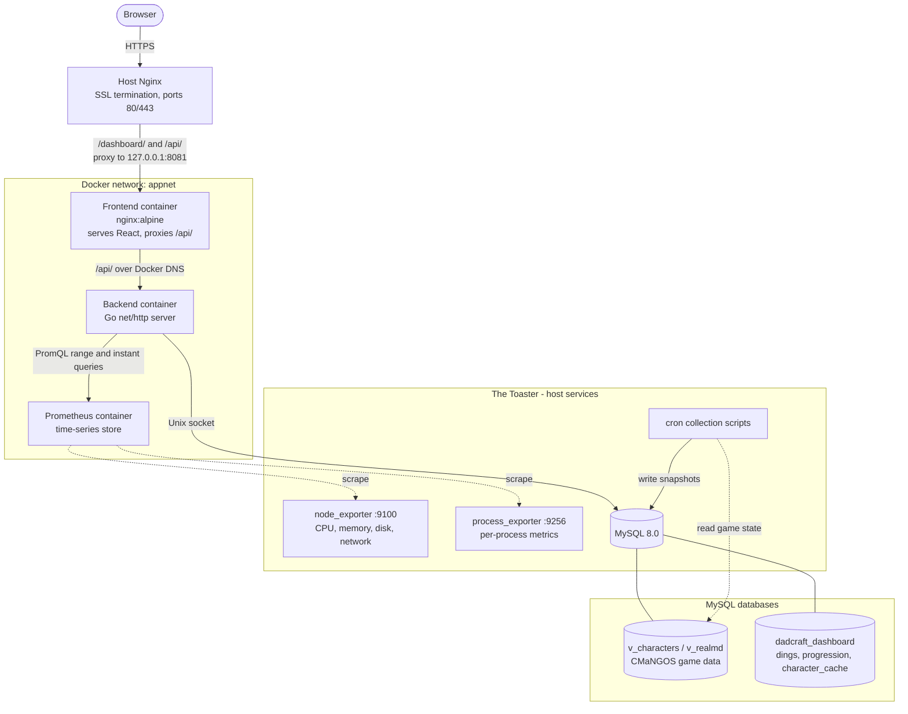
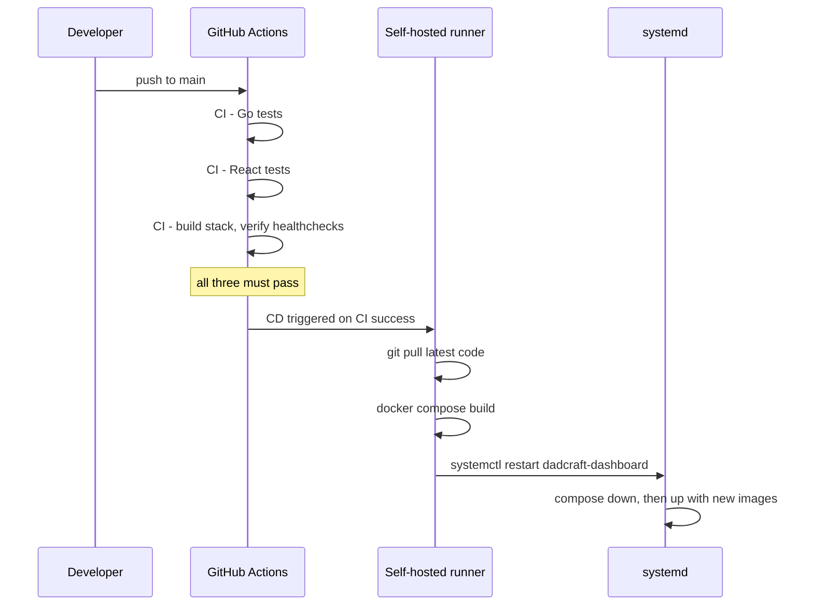
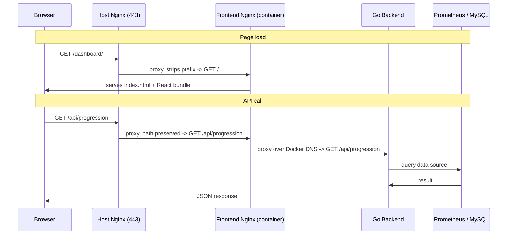
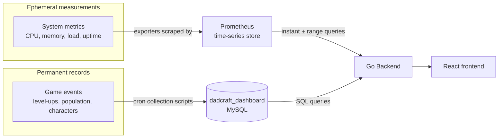

# dadcraft-dashboard

A full-stack monitoring and analytics dashboard for a self-hosted CMaNGOS World of Warcraft private server, providing at-a-glance visibility into server health, system resources, and live game population.

> **Educational disclaimer:** This project is a software and infrastructure exercise built for learning purposes. It reads from a CMaNGOS server - the open-source World of Warcraft server emulator - and contains no proprietary Blizzard Entertainment assets or game client data. The data the dashboard displays is server-state metadata (character names, levels, zones, population counts), not game content. The repository contains application code only; any client files required to run a CMaNGOS server are supplied independently and are not part of this codebase.

## Stack

| Layer | Technology |
|---|---|
| Frontend | React 19, Vite 8, Recharts |
| Backend | Go (standard library `net/http`, no framework) |
| System metrics | Prometheus, node_exporter, process_exporter |
| Game data | MySQL 8.0 (CMaNGOS database, plus a purpose-built dashboard database) |
| Containerization | Docker, Docker Compose |
| Reverse proxy | Nginx (host and container tiers) |
| CI/CD | GitHub Actions, self-hosted runner |
| Host | Ubuntu 24 LTS home lab server |

## What This Is

Dadcraft Dashboard is a monitoring and analytics dashboard for "World of Dadcraft", a self-hosted CMaNGOS World of Warcraft private server running on a home lab machine. CMaNGOS is the open-source WoW server emulator; the server is populated by an AI bot system that levels characters and roams the world autonomously. Before this project, checking server health meant SSHing in and running manual commands. The dashboard replaces that with a live view of system resources, game-server process health, and the game world's population.

The data behind the dashboard comes from a living game world. The server is populated entirely by AI bots that quest, kill monsters, participate in the auction-house economy, form guilds, and engage in world PvP autonomously and continuously. The population curves, leaderboard standings, and character records the dashboard displays are all snapshots of that world in motion, not static sample data.

The dashboard presents four panels. Progression renders the server population as a level curve over time, filterable by faction, race, class, guild, and online status, with a calendar-based period navigator and a snapshot slider for scrubbing through history. Character Search is a dynamic filter interface over a cached character table, with the filter UI driven entirely by a field registry the backend serves to the frontend. Leaderboard tracks the race to the server's level frontier, ordered by who reached each level first. Metrics is a system-health view with clickable tiles and a brush-driven dual-chart for navigating Prometheus time-series data.

The project was built incrementally over a series of evening sessions, written from scratch with test-driven development from the first commit, conventional commit messages, and a clean dev/prod environment split. It is deployed to production through a self-hosted CI/CD pipeline. It demonstrates a complete full-stack system: a Go HTTP API, a React single-page application, two distinct data sources with different persistence models, containerized deployment, and a working observability pipeline.

This README documents the application as it currently runs, live, against that world. The repository is one half of the system: the application code and its collection scripts are version-controlled here, but the surrounding infrastructure (system exporters, the MySQL databases, host reverse proxy, and CI/CD runner) lives on the server. See [Honest Scope](#honest-scope) for what cloning this repository does and does not give you.

## Live Demo

The dashboard is live and running against the production server:

**https://wow.jjg.dev/dashboard/**

It is backed by the real game world described above, so the population, leaderboard, and character data are current.

## Architecture

The system runs as three Docker containers behind a two-tier Nginx setup, drawing from two separate data sources on the host.



The backend never talks to the public internet directly. The frontend container binds only to the host loopback interface, and the host Nginx is the sole public entry point. The Go backend has no host-exposed port at all and is reachable only within the Docker network.

## Repository Structure

```
dadcraft-dashboard/
├── .github/
│   └── workflows/
│       ├── ci.yml                      # Parallel Go + React tests, then full-stack container health check
│       └── cd.yml                      # Deploy on CI success via self-hosted runner
├── backend/                            # Go HTTP API
│   ├── handlers/                       # HTTP layer: routing targets, request/response only
│   │   ├── character_search.go         # Field registry endpoint + parameterized search
│   │   ├── cors.go                     # CORS middleware
│   │   ├── db.go                       # Generic DB query handler
│   │   ├── health.go                   # Health endpoint (used by container healthcheck)
│   │   ├── leaderboard.go              # Leaderboard handler (MySQL-backed)
│   │   ├── metrics.go                  # Prometheus scalar and range handlers
│   │   └── progression.go              # Progression + timestamp handlers (MySQL-backed)
│   ├── models/                         # Data shapes and domain knowledge, no behavior
│   │   ├── character_search.go         # Field registry, filter types, request shapes
│   │   ├── db.go                       # TableResult shape
│   │   ├── leaderboard.go              # LeaderboardEntry shape
│   │   ├── metrics.go                  # Prometheus response shapes + extraction methods
│   │   ├── query.go                    # BuildQuery: SQL fragment composition
│   │   └── wow.go                      # Race/class CASE-expression constants
│   ├── repository/                     # Data access: Prometheus HTTP and MySQL
│   │   ├── db.go                       # MySQLRepository (connection pool)
│   │   ├── metrics.go                  # PrometheusRepository (instant, range, at-timestamp)
│   │   └── repository.go               # Repository interfaces
│   ├── Dockerfile                      # Single-stage Go build, static binary
│   └── main.go                         # Composition root: wires dependencies, registers routes
├── frontend/                           # React single-page application
│   ├── src/
│   │   ├── api/                        # Fetch layer: one module per backend resource
│   │   ├── components/                 # Panels, charts, filter controls
│   │   ├── constants/                  # Game data (wow.js), metric configs, quick searches
│   │   ├── hooks/                      # Data-fetching and lifecycle hooks
│   │   ├── utils/                      # Pure functions: formatting, bucketing, chart merge
│   │   └── App.jsx                     # Tab navigation, panel composition
│   ├── Dockerfile                      # Multi-stage: Node build -> nginx:alpine serve
│   └── nginx.conf                      # Container Nginx: static files + /api/ proxy
├── prometheus/
│   └── prometheus.yml                  # Scrape config for node_exporter and process_exporter
├── scripts/                            # Operational tooling and SQL collection pipeline
│   ├── collect_dings.sh                # Cron: records character level-up events
│   ├── collect_progression.sh          # Cron: snapshots population by level/race/class
│   ├── collect_character_cache.sh      # Cron: caches decoded character data for search
│   ├── backfill_lifetime_honor.sql     # One-time honor-count correction
│   ├── init_area_names.sql             # Zone ID -> name reference table
│   ├── init_character_cache.sql        # character_cache schema (idempotent DDL)
│   ├── dev.sh                          # Local dev launcher
│   └── nuke_dashboard_db.sh            # Wipes dashboard tables for a server reset
├── docker-compose.yml                  # Production: three services, shared network
└── docker-compose.dev.yml              # Dev override: exposes Prometheus port to host
```

## Deployment Overview

In production, the stack runs as a systemd service that wraps Docker Compose. The systemd unit handles `docker compose up` and `down`, restarts the stack on failure, and orders startup after MySQL is available. Three containers come up in a dependency chain: Prometheus first, then the backend (which waits for Prometheus to report healthy), then the frontend (which waits for the backend).

Deployment is automated. A push to `main` triggers the CI pipeline, which runs three jobs: Go tests, React tests, and a full-stack job that builds the images, starts the stack, and waits for every container healthcheck to pass. Only if all three succeed does the CD pipeline fire. CD runs on a self-hosted GitHub Actions runner on the production host itself, where it pulls the latest code, rebuilds the images, and restarts the systemd service.



If CI fails, CD never runs and the old containers keep serving. Broken code does not reach production. There is no automated rollback; a bad deploy that passes CI requires a manual hotfix or revert.

The system-level metrics exporters (`node_exporter`, `process_exporter`) run as their own systemd services on the host, outside Docker, so they have direct access to `/proc` and `/sys`. The three `collect_*.sh` scripts run as cron jobs, writing game-event data into the dashboard's MySQL database on a schedule.

## Request Flow

Two Nginx tiers sit between the browser and the application, and the path prefix each tier strips is the part most worth understanding. The host Nginx strips `/dashboard/`; the container Nginx strips nothing from `/api/` and forwards it as-is. A page request and an API request therefore take noticeably different routes.



The trailing slash on an Nginx `proxy_pass` directive is what controls prefix stripping: a trailing slash substitutes the matched location prefix, while its absence forwards the path unchanged. The host `/dashboard/` block uses a trailing slash; the `/api/` blocks deliberately do not.

## Design Notes

**Why the Go standard library instead of a web framework?**

The backend uses `net/http` directly, with no Gin, Fiber, or Echo. This was a deliberate decision: the project was a first exposure to Go, and starting with the standard library meant learning how HTTP routing, handlers, and middleware actually work before reaching for a framework that hides them. For an API of this size the standard library is also entirely sufficient on its own merits - `ServeMux` and `HandlerFunc` cover the routing, and the one cross-cutting concern, CORS, is a single handler-wrapping function. Keeping the request path explicit rather than abstracted behind framework conventions was a feature, not a compromise.

**Why two separate repository interfaces?**

The backend reads from two sources: Prometheus over HTTP and MySQL over a connection pool. These are kept as two distinct interfaces (`MetricsRepository` and `DBRepository`) rather than one combined interface. Combining them would force every Prometheus test fake to implement database methods it has nothing to do with, and vice versa. Each interface describes one coherent capability, which keeps the test fakes small and the dependencies honest. `main.go` is the single composition root that constructs the concrete implementations and wires them into handlers.

**Why MySQL for game history and Prometheus only for system metrics?**

This is the central architectural decision of the project, and it was reached the hard way. The dashboard has two kinds of data with genuinely different shapes. System metrics (CPU, memory, load, process uptime) are ephemeral measurements: the question is "what is the value right now, and was it healthy recently." Game events (a character reaching a new level, the population's level distribution at a point in time) are records: they happen once and need to be queryable as permanent history.

The project originally used Prometheus for both. Custom Prometheus exporters wrote game data into the time-series database, and the backend used range queries to reconstruct event history. This failed twice. Prometheus evaluates range queries at computed step timestamps that must align closely with actual scrape times to fall within its staleness lookback window; over long time spans the two sequences drift out of phase, and queries return empty. Year-scale range queries also exceed Prometheus's internal sample limits. Both the leaderboard and the progression time-slider were built against Prometheus, and both broke for this reason.

The resolution was to stop using Prometheus as a database. A dedicated MySQL database, `dadcraft_dashboard`, was introduced. Cron-driven scripts record game events at the moment they occur: a `dings` table captures level-up events, and `progression_snapshots` captures periodic population snapshots keyed by an auto-incrementing scrape ID rather than a timestamp. The backend leaderboard and progression handlers were rewritten as plain MySQL queries. Prometheus was kept strictly for system metrics, which is what it is actually designed for.



**Why a cron-driven collection pipeline instead of querying the game database live?**

The CMaNGOS database stores race, class, and gender as integer IDs, requires joins to resolve guild names and GM status, and stores zone as a raw integer. Querying it live for every dashboard request would mean repeating that decoding and those joins on every page load. Instead, the collection scripts do the work once at scrape time and write decoded, denormalized rows into the dashboard database. The dashboard then queries clean, pre-decoded tables with no joins. The `character_cache` table additionally uses a hash-based change detector so that each cron run only writes rows that actually changed.

**Why is the character search filter UI driven by a backend registry?**

The set of searchable character fields, their types, and their valid values is defined once on the backend as a field registry. The frontend fetches this registry on mount and renders the entire filter interface from it: a string field becomes a text input, an enum field becomes checkboxes, a range field becomes min/max inputs. The same registry is used on the backend to validate incoming requests. Adding a searchable field is a single backend change that appears in the UI automatically, and there is no second list to keep in sync.

**How does the character search endpoint stay safe against SQL injection?**

The search endpoint accepts a user-defined filter payload, which means user input shapes the query. Two layers protect it. First, every field name in the payload is checked against the registry whitelist before it is allowed anywhere near the SQL string; field names are the only user-supplied values interpolated into query text, and only after that check. Second, all user-supplied values go through parameterized `?` placeholders, so the MySQL driver sends query structure and values separately and the database parses the structure before it ever sees a value. The endpoint also caps result limits and multi-value filter lists server-side.

**Why a brush-driven dual-chart for the metrics view?**

A single chart cannot serve both navigation and detail. A wide time window at a readable point count gives coarse resolution; a fine resolution over a wide window returns too many points. The Metrics panel uses the pattern Grafana uses: a coarse overview chart that always shows the full lookback window and carries a brush control, and a separate detail chart that renders only the brushed window at fine resolution and re-fetches when the brush settles. Step size is derived automatically from the selected window to target a stable point count, snapping to human-readable intervals. A granularity control lets the user override the derived step for the detail chart.

**Why is so much infrastructure outside the repository?**

The dashboard exists alongside a continuously running game server, and much of what makes it work is server-side state: the metrics exporters, the host Nginx virtual host, the systemd units, the MySQL databases, and the CI/CD runner. These are described throughout this README as architecture context, because a reader needs them to understand how the system runs, but they are not version-controlled here. The in-repo `scripts/` directory and the `init_*.sql` files are the half of the data pipeline that is reproducible from the repository. Bringing the rest into a reproducible form is a planned direction; see Honest Scope.

## Prerequisites

Running the full system as deployed requires more than the repository contents:

- Docker and Docker Compose on the host.
- A running CMaNGOS server with its MySQL databases (`v_characters`, `v_realmd`), reachable by the backend container. The backend connects over a Unix socket by default.
- The `dadcraft_dashboard` MySQL database, created and granted to the application database user, with its tables initialized from the `init_*.sql` scripts.
- `node_exporter` and `process_exporter` installed and running on the host, with `process_exporter` configured to watch the game-server processes.
- A reverse proxy on the host for public access and SSL termination, if the dashboard is to be exposed beyond the local network.

The backend is configured entirely through environment variables (database DSN, Prometheus URL, CORS origin, disk mountpoint, and network device); see `backend/.env.example` for the full set and example values.

## Local Development

`scripts/dev.sh` runs the application outside containers for a fast edit-reload loop. It brings up Prometheus with a development override that exposes its port to the host, then runs the Go backend directly with `go run` and the Vite dev server with hot module replacement. Vite proxies API calls to the local backend, mirroring what the container Nginx does in production.

Local development still depends on the same external pieces as production: a reachable MySQL instance with the CMaNGOS and dashboard databases, and the host exporters running for the metrics panels to show data. The dev loop speeds up application iteration; it does not remove the infrastructure dependencies.

## Honest Scope

This is a real, deployed application, not a proof of concept, and it has been running in production through its CI/CD pipeline across the development period. Both the Go backend and the React frontend have full test coverage, and the CI pipeline gates deployment on those tests plus a full container-health check.

What this repository is not, today, is a turnkey deployment. Cloning it gives you the application and its collection scripts. It does not give you a running system, because the system depends on infrastructure that is provisioned on the server and not version-controlled here: the metrics exporters, the MySQL databases and their grants, the host reverse proxy, and the CI/CD runner. A clone is the application half of a system whose other half is server-side state. Making the project genuinely clone-and-run, for use by others in the CMaNGOS community, is an intended direction rather than the current state.

A few more boundaries worth stating plainly. The UI is functionally complete but unstyled; component structure and behavior were prioritized over visual design, and a styling pass is intended but not done. The metrics detail chart does not poll, so it can go stale while open until the page is refreshed or the brush is moved. The dashboard's database user holds read-only access to the game database and read-write access only to the dashboard's own database, so the blast radius of a compromised backend is read access to character and account metadata, not the game world itself; CMaNGOS does not store account passwords in plaintext, so credentials are not exposed by that access. Finally, the dashboard currently runs against a single small private server. Query costs and collection intervals were designed with a substantially larger population in mind, and index usage was analyzed against that growth case; the display-facing caps, such as leaderboard depth and search page sizes, are the parts tuned to the current scale and would be the first thing revisited as the world grows.
